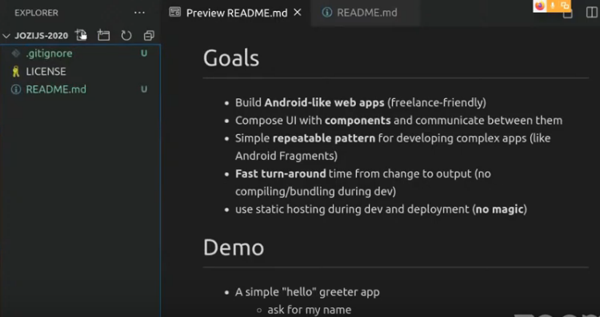

# Jozi.js - Building web apps in plain JavaScript

[This talk](https://www.meetup.com/Jozi-JS/events/271620720/), aimed towards beginners, walks through creating a modern web app using plain HTML, CSS, and JavaScript.

The idea is to aim for simplicity, and to understand how modern browsers work (we will make use of Web Components too), while learning a minimum set of tools and concepts that will allow you to build production-ready apps.

We won't be using any frameworks, so no prior knowledge is needed, other than basic HTML and JavaScript.

# Replay

Watch the replay of the talk:

[)](https://www.youtube.com/watch?v=nEORHVdCzEs&t=22m)

# Vueangulact

- Recently had the misfortune of using a popular JavaScript framework
- The "features" on the homepage look like things the Web API already does well
- Not clear what problems the framework is solving
- Maybe the web has caught up, like with JQuery?
- I decided to find out...

# Goals

- Build **Android-like web apps** (freelance-friendly)
- Compose UI with **components** and communicate between them
- Simple **repeatable pattern** for developing complex apps (like Android Fragments)
- **Fast turn-around** time from change to output (no compiling/bundling during dev)
- use static hosting during dev and deployment (**no magic**)

# Demo

- A simple "hello" greeter app
  - ask for my name
  - greet me

# Summary

- **Tools**:
  - [npm](https://www.npmjs.com) to install stuff
  - [VSCode](https://code.visualstudio.com/) with Prettier, ESLint, Template Literal Editor
  - [Snowpack](https://www.snowpack.dev/) to import UI web components
- **Tech Stack**:
  - Plain HTML5, CSS4, JavaScript (ES6)
  - [Web Components](https://developer.mozilla.org/en-US/docs/Web/Web_Components) (shadow DOM, slots)
- **Architecture**:
  - Base `WebComponents` class to simplify lifecycles and reduce boilerplate code
  - _Stand-alone_ child elements with public methods, callbacks, sparingly emits events
  - _Container_ web components that co-ordinate the child elements

# Next steps

- Bundling & transpile:
  - webpack/[parcel plugin](https://github.com/pikapkg/create-snowpack-app/tree/master/packages/plugin-parcel) for snowpack
- Progressive Web App:
  - Learn about [progressive web apps](https://web.dev/progressive-web-apps/)
  - Put your PWA on an app store: [pwabuilder.com](https://pwabuilder.com)
- Other UI components:
  - Carbon design system: [carbondesignsystem.com](https://carbondesignsystem.com)
  - Ionic components: [ionicframework.com/docs/components/](https://ionicframework.com/docs/components/)

# The framework tradeoff

- Without a framework, updating the UI when state changes can be tedious
- Frameworks add a lot of complexity to solve this trivial problem
- Frameworks come and go -> try updating your app after a few years
- With Web Components, CSS4, and ES6+, plain web dev is fun, IMHO

# Resources

- This presentation: github.com/tobykurien/jozijs-2020
- Article: [Web Components will replace your frontend framework](https://blog.usejournal.com/web-components-will-replace-your-frontend-framework-3b17a580831c?gi=53fe9e236d27)
- Guidelines/recommendations: [Open Web Components](open-wc.org)

# Contact

> https://tobykurien.com  
> [@tobykurien](https://twitter.com/tobykurien)
